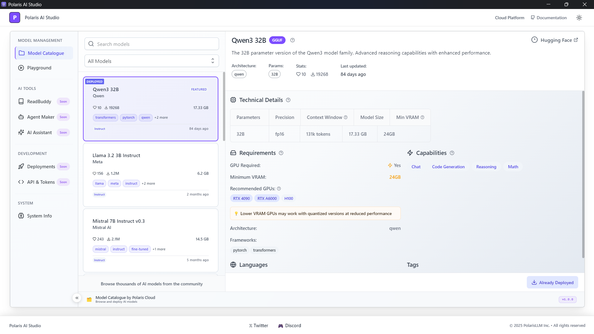

<div align="center">
  <h1>🌟 Polaris AI Studio</h1>
  
  <p align="center">
    <strong>Next-Generation AI Platform for Intelligent Applications</strong>
    <br />
    Build, Deploy, and Scale AI Solutions with Ease
    <br />
    <br />
    <a href="#getting-started"><strong>Get Started »</strong></a>
    ·
    <a href="#features"><strong>Features</strong></a>
    ·
    <a href="#playground"><strong>Playground</strong></a>
    ·
    <a href="#contact"><strong>Contact</strong></a>
  </p>
</div>

---

## 🚀 About Polaris AI Studio

Polaris AI Studio is a comprehensive AI development platform that empowers developers, researchers, and businesses to harness the power of artificial intelligence. With an intuitive interface and powerful capabilities, Polaris AI Studio makes advanced AI accessible to everyone



## ✨ Features

### 🎮 **AI Playground**
- **Interactive Chat Interface**: Engage with multiple AI models through an elegant, responsive chat interface
- **Model Selection**: Choose from a variety of cutting-edge AI models including:
  - Qwen 2.5 7B
  - DeepSeek R1
  - Llama 3.3 70B
  - Phi-4
  - And many more...
- **Real-time Responses**: Experience lightning-fast AI responses with streaming capabilities
- **Chat History**: Organized conversation history with search functionality
- **Sample Prompts**: Quick-start templates for common AI tasks

### 🛠 **Development Tools**
- **System Information**: Monitor runtime engines and system performance
- **Model Catalogue**: Browse and manage AI models with detailed specifications
- **API Integration**: RESTful API endpoints for seamless integration
- **Token Management**: Secure API key and token management system

### 🔮 **Coming Soon**
- **ReadBuddy**: Document chat and intelligent reading assistant
- **Agent Maker**: Create and customize AI agents for various tasks
- **AI Assistant**: Personalized AI assistant for everyday productivity
- **API & Tokens**: Advanced API management and integration tools
- **Deployments**: Cloud deployment and scaling solutions

### 🎨 **User Experience**
- **Modern UI/UX**: Beautiful, responsive interface with light and dark themes
- **Cross-Platform**: Desktop application built with Electron
- **Real-time Updates**: Live data updates and notifications
- **Responsive Design**: Optimized for all screen sizes and devices

## 🏁 Getting Started

### Prerequisites
- Node.js (v22 or higher)
- npm or yarn package manager

### Installation

1. **Clone the repository**
   ```bash
   git clone https://github.com/BANADDA
   /polaris-ai-studio.git
   cd polaris-ai-studio
   ```

2. **Install dependencies**
   ```bash
   npm install
   ```

3. **Start the development server**
   ```bash
   npm start
   ```

4. **Open Polaris AI Studio**
   The application will launch automatically in your default browser or as a desktop app.

### Building for Production

To create a production build:

```bash
npm run package
```

## 🎮 Playground

The Polaris AI Studio Playground is the heart of the platform, offering:

- **Multi-Model Chat**: Switch between different AI models seamlessly
- **Conversation Management**: Organize chats by date with search functionality
- **Advanced Parameters**: Fine-tune model behavior with generation settings
- **Export Options**: Save and share conversations
- **Prompt Templates**: Use pre-built prompts for common tasks

### Quick Start Example

```javascript
// Example API call to Polaris AI Studio
const response = await fetch('/api/chat/completions', {
  method: 'POST',
  headers: {
    'Content-Type': 'application/json',
    'Authorization': 'Bearer YOUR_API_KEY'
  },
  body: JSON.stringify({
    model: 'qwen-2.5-7b',
    messages: [
      { role: 'user', content: 'Hello, Polaris AI Studio!' }
    ]
  })
});

const data = await response.json();
console.log(data.choices[0].message.content);
```

## 🏗 Architecture

Polaris AI Studio is built with modern web technologies:

- **Frontend**: React + TypeScript + Joy UI
- **Backend**: Node.js + Express
- **Desktop**: Electron
- **Styling**: CSS-in-JS with theme support
- **State Management**: React hooks and context
- **Build System**: Webpack + Babel

## 🤝 Contributing

We welcome contributions to Polaris AI Studio! Please see our [Contributing Guidelines](CONTRIBUTING.md) for details.

### Development Workflow

1. Fork the repository
2. Create a feature branch (`git checkout -b feature/amazing-feature`)
3. Commit your changes (`git commit -m 'Add amazing feature'`)
4. Push to the branch (`git push origin feature/amazing-feature`)
5. Open a Pull Request

## 📝 License

Distributed under the MIT License. See `LICENSE` for more information.

## 🌐 Contact

**Polaris AI Studio Team**

- Website: [https://polaris-ai-studio.com](https://polaris-ai-studio.com)
- Email: contact@polaris-ai-studio.com
- Twitter: [@PolarisAIStudio](https://twitter.com/PolarisAIStudio)
- Discord: [Join our community](https://discord.gg/polaris-ai-studio)

## 🙏 Acknowledgments

- Thanks to all contributors who have helped shape Polaris AI Studio
- Built with love using React, Electron, and modern web technologies
- Special thanks to the open-source AI community

---

<div align="center">
  <p><strong>⭐ Star this repository if you find Polaris AI Studio helpful!</strong></p>
  <p>Made with ❤️ by the Polaris AI Studio team</p>
</div>
